
# Proyecto con un servidor web y un servidor de base de datos dockerizado

### 1️⃣ Descargar las imágenes necesarias
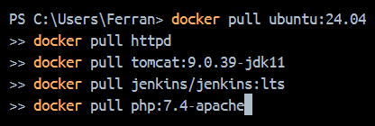

---

### 2️⃣ Mostrar las imágenes descargadas
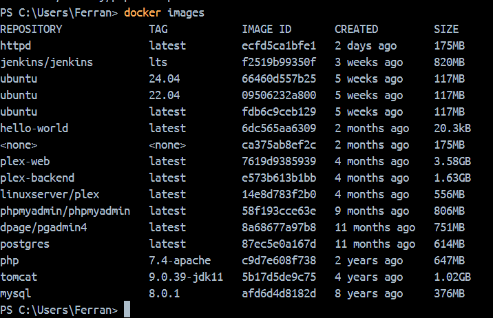

---

### 3️⃣ Crear un contenedor demonio con la imagen php:7.4-apache
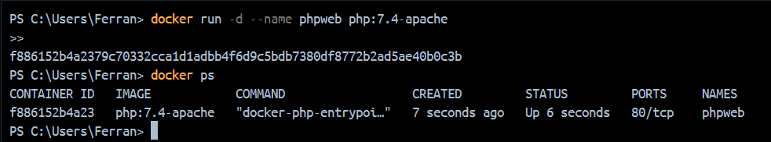

---

### 4️⃣ Comprobar el tamaño del contenedor en el disco duro
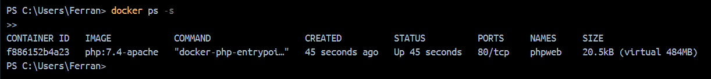

---

### 5️⃣ Copiar un fichero info.php al contenedor
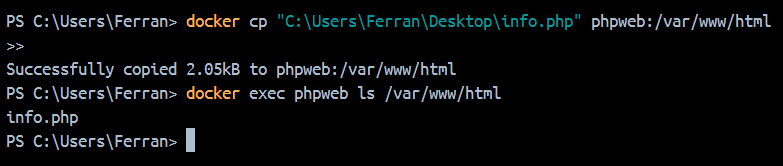

---

### 6️⃣ Volver a comprobar el espacio ocupado
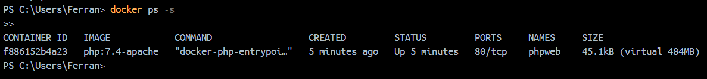

---

### 7️⃣ Acceder al fichero info.php desde un navegador
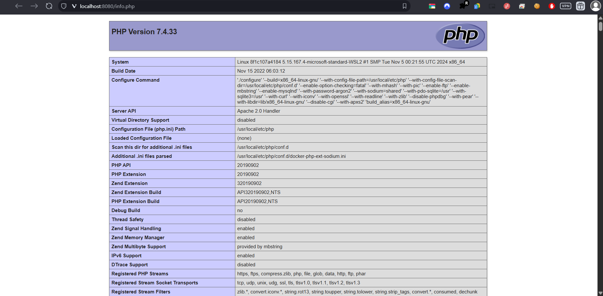

---

## 🌐 PARTE 2 — Servidor web

### 1️⃣ Crear el contenedor "web"
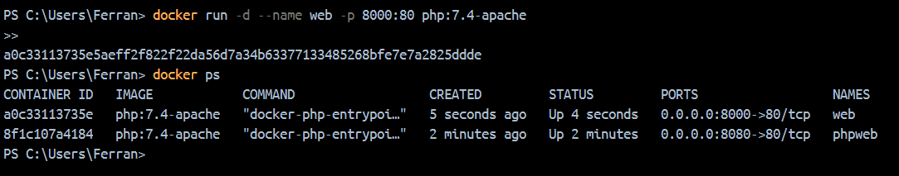

---

### 2️⃣ Crear los ficheros dentro del contenedor
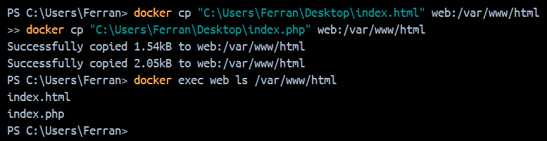

---

### 3️⃣ Ver index.html en el navegador
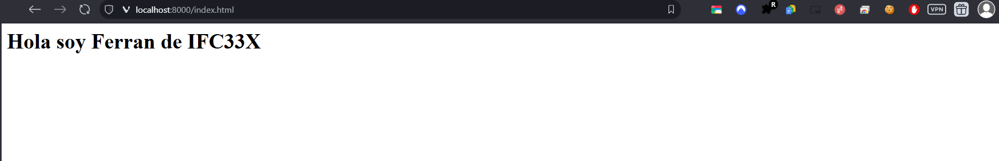

---

### 4️⃣ Ver index.php en el navegador

---

### 5️⃣ Ver el tamaño del contenedor después
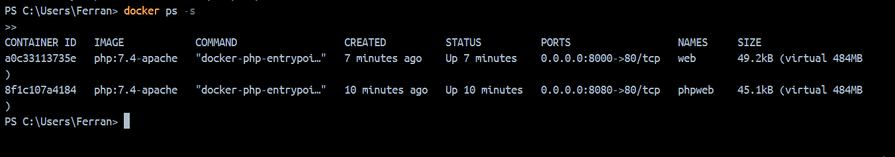

---

## 🗃️ PARTE 3 — Servidor de base de datos

### 1️⃣ Crear el contenedor de MariaDB
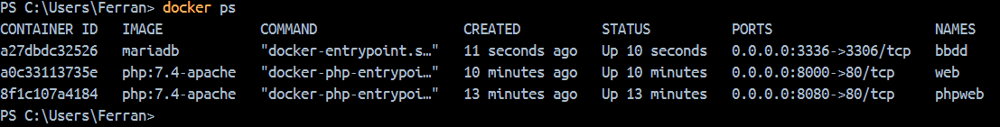

---

### 2️⃣ Conectarse desde un cliente externo
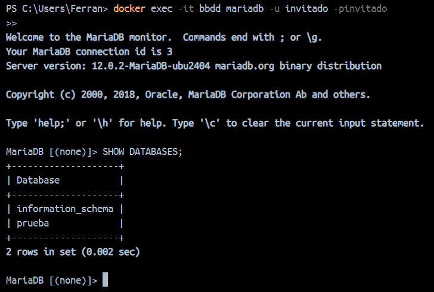

---

### 3️⃣ Comprobar que no se puede borrar la imagen
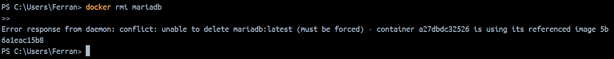

